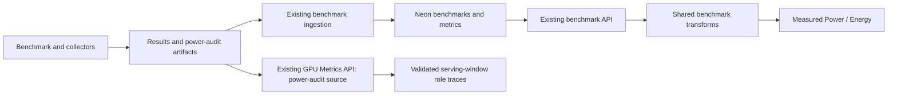

# PowerX charts in the existing Dashboard

[中文](./powerx-permanent-view_zh.md)

PowerX extends the existing gated **Measured Power / Measured Energy** controls in `/inference` and the existing `/gpu-metrics` page. The goal is to make article comparisons directly capturable from the Dashboard, with share links that restore the chosen data and graph. There is no separate article page or frozen article dataset in the app.

## Article graph coverage

| Comparison                                                 | Existing Dashboard control                                                                                                                             |
| ---------------------------------------------------------- | ------------------------------------------------------------------------------------------------------------------------------------------------------ |
| H200 measured versus provisioned energy/power              | Measured Power or Energy → Compare → Power boundaries; four boundaries on the same axes, with adjacent power/energy panels                             |
| B200/MI355X, B200/B300, GB200/GB300 at equal service speed | Existing hardware filters and Interactivity, TTFT or E2E axes; native Perf Ruler on single-metric plots, or an on-chart ISO marker in comparison plots |
| Prefill versus decode power and role-local energy          | Compare → Prefill and decode; role labels retain input/output-token denominators                                                                       |
| Complete-request energy and prefill fraction               | Compare → Request energy split; paired role-power/share panels and common-output-token contributions below                                             |
| Relative hardware power/output/energy changes              | Compare → Relative hardware comparison; choose baseline and comparator configuration/run; shared service-level X, no concurrency matching              |
| GB200/GB300 power over the formal serving window           | GPU Metrics → Serving-window power; choose run, artifact and window, then a second run                                                                 |

The original single-metric plot retains its measured scope, average/P75/P90, percent-of-TDP and energy denominator/unit controls. Returning from a provisioned boundary restores the previous measured selection.

Repeated-run means and min/max bands require an explicitly selected repeat cohort; a latest benchmark row is not an N=3 average. Extra-analysis regression plots are outside this milestone.

## Data path

Comparison plots consume the same workload, precision, date/run, hardware and unofficial-run selections. They start before selected-Y-metric coverage filtering so a missing measured value cannot remove a valid provisioned point. Missing series values leave gaps; they are never zeros. Lines connect adjacent observations within their configuration, date and source run and are explicitly distinct from Pareto frontiers. ISO markers use linear interpolation only between valid neighboring observations, without extrapolation or ambiguous duplicate-X selection. Single-metric Perf Ruler continues to measure native rendered curves.

Single-metric power views share the existing Measured Power behavior: **Optimal Only** shows boundary points when on and all points when off, without changing the curve, axis domain, zoom or ruler. This applies to measured, modeled chassis and provisioned/modeled facility watts in both chart layouts and unofficial overlays. Constant modeled/provisioned watts retain the tested X range. Energy views retain their lower-energy Pareto frontiers.

## Four boundaries

| Boundary            | Power                                               | Energy per successful output token                                    |
| ------------------- | --------------------------------------------------- | --------------------------------------------------------------------- |
| GPU measured        | Producer GPU-board measurement                      | Producer same-window integrated GPU energy / successful output tokens |
| GPU provisioned     | Hardware-registry TDP                               | TDP / output throughput per all allocated GPUs                        |
| Utility provisioned | Hardware-registry facility allocation per GPU       | Allocation / output throughput per all allocated GPUs                 |
| Utility modeled     | Existing supported system model, including PUE once | Measured GPU J/output-token × modeled facility W / measured GPU W     |

Registry TDP, a runtime-configured power cap, and measured draw are different values. Modeled watts also reuse the shared model’s explicitly validated historical single-node power contract; modeled energy still requires schema-2 same-window evidence. Each panel reports missing series coverage. Facility modeling remains an estimate with the existing model revision, chassis/calibration coverage and CPU/DRAM/PUE assumptions. Unsupported hardware/workloads do not borrow another model. Fixed-sequence disaggregated throughput is normalized from decode GPUs to all allocated GPUs; AgentX throughput already uses the full allocation.

Role energy reconstruction requires validated schema-2 disaggregation and positive aggregate/role energy metrics. Because aggregate J/input and J/output share one energy numerator, their ratio recovers the actual successful input/output-token ratio. Multiply prefill J/input by that ratio before combining it with decode J/output. Missing either role or denominator produces no reconstructed total or fraction. This is not a nominal request-length assumption.

## Serving-window telemetry

`/api/gpu-metrics?runId=…&source=power-audit` reads existing `power_audit_*` artifacts. GitHub retention bounds historical availability: expiring or removed artifacts need a durable archive before these links can serve as permanent publication evidence. The default raw GPU-metrics API/view remains available. The audit response retains artifact identity, manifest, samples, serving windows and validation data; the browser performs the chart transformation.

Devices are identified by host and device index and assigned to roles from the manifest. Samples must bracket the formal serving window with the expected device coverage. Each device is clipped/interpolated at the exact window endpoints, integrated, and checked against accepted validation energy before role aggregation. A missing device, role mismatch, invalid window or unusable sampling coverage is shown as unavailable, not a partial pool.

Each panel starts at its own serving-window zero and shows pool GPU count, duration, mean watts, sampled maximum and source artifact. Both panels share a power scale. Prefill is dashed and decode solid. The TDP reference uses the current hardware registry and is labeled separately from recorded draw or a historical runtime cap. Sampled maxima do not establish sub-sample electrical peaks.

## Sharing, freshness and screenshots

- Inference share state uses `i_mcompare` for comparison mode, `i_mstat` for X statistic, `i_iso` plus `i_iso_axis` for the target and resolved X field (for example `mean_intvty`), and `i_mbase` / `i_mcomp` for exact relative-comparison configuration/date/run/overlay identities. A target without a matching axis signature is not restored. Native ruler pairs/targets remain in `i_rulers` with their own axis signature.
- GPU Metrics share state records source view, both run IDs, artifact names and immutable `gm_artifactId` / `gm_compareArtifactId` pins, and window identities. Missing pinned artifacts/windows show unavailable rather than falling back to another selection. Links contain no credentials or embedded telemetry.
- Latest measured views revalidate availability and active benchmark queries on focus and every five minutes while visible. Explicit run/date/history views remain pinned. Upstream collection, ingestion and API-cache publication are separate from this client refresh.
- For stable article links, pin **Run Date** before selecting a relative source pair and sharing. Latest links intentionally follow the newest population; an exact saved source that is absent after refresh becomes unavailable rather than being replaced.
- Captions name the actual statistic and measurement boundary. Model estimates, reconstructed role values and interpolated ISO values are labeled accordingly.
- Exact historical article numbers require the article's runs, statistic, fixed-power reference and repeat-aggregation rule. Selecting current data supports the same graph capability without claiming the same cohort or conclusion.

## Acceptance

Focused unit and browser tests cover boundary arithmetic, all-GPU disaggregated normalization, missing/invalid input, role reconstruction, role-time integration, curve interpolation bounds, existing filter/overlay behavior, shared-view restoration and desktop/mobile layouts. Real artifact comparisons must reproduce known durations, role means and sampled peaks before screenshot delivery. The feature remains behind the existing gate; no new deployment or publication path is introduced.

Relative comparison keeps source configurations and runs separate. It interpolates both values at the same X before calculating percent changes: `(comparator − baseline) / baseline` for power and output, `(baseline − comparator) / baseline` for energy reduction. Derived comparisons use the union of tested X values and the chosen ISO target inside overlapping coverage. Missing or ambiguous duplicate-X values leave gaps. Source identities and numeric direction remain visible in screenshots and CSV exports.
