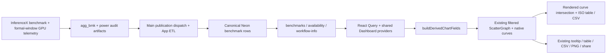

# PowerX in Measured Power and Measured Energy

PowerX extends the existing **Measured Power** and **Measured Energy** families in
`/inference` and `/zh/inference`. Their existing ↑↑↓↓ feature gate, Y-axis menu,
filters, chart controls and sharing remain the entry point. A **Boundary** select
adds GPU provisioned, all-in utility provisioned and all-in utility modeled to
GPU measured. `/gpu-metrics` remains the upstream raw run-telemetry dashboard.

## Data flow

No new endpoint, DB column, provider, route or frozen article dataset is required.
Official and unofficial data use the same field builder and their existing
visibility rules. The [article and Oren's comments](https://docs.google.com/document/d/16Evxj4yuAqYWRHmkz-CIL7CKDIU-DPBiklrTs2QpnJM/edit)
supply the four boundaries and matched-interactivity requirement.

## Boundaries and controls

| Boundary            | Power                                     | Energy                                           |
| ------------------- | ----------------------------------------- | ------------------------------------------------ |
| GPU measured        | Existing mean/P75/P90/role watts or %TDP  | Existing input/output/total/query J and query Wh |
| GPU provisioned     | Registry GPU TDP, W/chip                  | TDP / all-GPU output throughput                  |
| Utility provisioned | Registry facility kW/chip × 1000          | Facility W/chip / all-GPU output throughput      |
| Utility modeled     | Modeled deployment facility W / GPU count | GPU J/output token × modeled/measured GPU W      |

The original 13 GPU telemetry keys, Scope/Statistic/Display/Per/Unit controls,
legacy admission and validity indicators are retained. The other boundaries add
six derived metric keys and use whole-deployment W/chip or J/output token. They
appear in the same two families, with the boundary encoded by `i_metric`.

Fixed-sequence disaggregation reports throughput per decode GPU. Provisioned
energy first multiplies throughput by `decode / (prefill + decode)`; both pool
counts must be known. AgentX throughput already uses all GPUs. Aggregate serving
does not sum mirrored role counts. Provisioned values are registry assumptions,
independent of telemetry validity and separate from configured GPU power caps.

Utility modeled requires valid schema-2 telemetry and a supported existing
chassis model. It applies the model's PUE once; partial chassis retain its
allocation rule. It is a mean-input estimate, not facility-meter telemetry or
integrated wall energy. Model revision, PUE and exclusions remain visible in
metric explanations; see [system-power assumptions](powerx-system-power.md).
No GB200/GB300 chassis model or AgentX calibration is added. Missing, invalid,
nonpositive, nonfinite or unsupported derived values are omitted, never zero-filled.
The existing measured availability treatment remains authoritative for GPU telemetry.

## Native curves and ISO

The existing power envelope / energy Pareto curves, logarithmic scales, percentile,
Optimal Only and Best per SKU behavior remain available. New provisioned watt
curves keep their flat support over the observed X range. The ISO section below
each chart reads the **actual displayed SVG curve** using the native performance
ruler's `intersectPathAtX`, then inverts the current Y scale. It does not install
a second interpolation policy or regroup the existing frontier by recipe.

Only currently visible official/overlay dated series participate. Exact chart
knots retain their values and source evidence; interior values are labeled curve
estimates, not new measurements. Missing curves, ambiguous coordinates and targets
outside tested support return unavailable. A singleton supports only its exact
X coordinate. Source points and runs are retained in the ISO CSV. Native frontier
construction may select different configurations across a hardware curve: the ISO
result compares that displayed boundary, not a controlled fixed-configuration experiment.

`i_iso` is the only new share parameter. Existing metric, X-axis, percentile,
model, workload, precision, hardware, date/run and overlay parameters are reused.
Changing X field clears the target because its units may have changed. Shared
links selecting gated metrics continue rendering while the picker is locked,
as upstream already permits.

With either family selected, a visible unpinned latest view refreshes availability
and active benchmark/workflow queries every five minutes and on focus. Date/run
pins and historical comparisons disable refresh. Existing filter and URL state
are not cleared. New eligible canonical rows need no frontend rebuild; successful
upstream ingestion, read-model refresh and server cache invalidation remain prerequisites.

## Acceptance and delivery

- Four boundaries roundtrip through the existing two families, URL and exports;
  all original telemetry controls and gated/shared-link behavior remain usable.
- Numeric tests cover all-GPU normalization, supported model inputs, missing values
  and the distinction between measured, provisioned and modeled values.
- ISO tests compare returned values to native rendered paths, including log scales,
  exact/singleton/out-of-range cases, filtered and dismissed unofficial curves.
- Browser checks cover new-point refresh, pinned history, filters, sharing, native
  telemetry regression, desktop and mobile English/Chinese layouts.
- Fixtures prove frontend behavior. Saved artifact → isolated DB → API → page
  replay and production cache/publication verification remain separate release gates.
