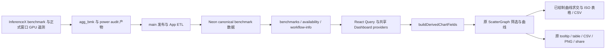

# 在 Measured Power 和 Measured Energy 中扩展 PowerX

PowerX 集成到 `/inference` 和 `/zh/inference` 现有的 **Measured Power** 与
**Measured Energy** 两组指标中，沿用 ↑↑↓↓ feature flag、Y 轴菜单、筛选器、图表控件及分享。
新增“功耗口径”选择器，在 GPU 实测之外提供 GPU 额定、全设施配置与全设施估算。
`/gpu-metrics` 保持 upstream 原有的运行遥测页面。

## 数据路径

无需新增 endpoint、数据库列、provider、路由或冻结的文章数据集。官方数据与 unofficial
run 沿用同一字段计算和各自的可见性规则。
[文章及 Oren 的评论](https://docs.google.com/document/d/16Evxj4yuAqYWRHmkz-CIL7CKDIU-DPBiklrTs2QpnJM/edit)
明确了四种功耗口径与相同 interactivity 下的比较需求。

## 功耗口径和控件

| 口径       | 功率                              | 能耗                                           |
| ---------- | --------------------------------- | ---------------------------------------------- |
| GPU 实测   | 原有平均/P75/P90/role 功率或 %TDP | 原有 input/output/total/query J 与 query Wh    |
| GPU 额定   | 注册表 GPU TDP，W/芯片            | TDP / 按全部 GPU 归一化的输出吞吐量            |
| 全设施配置 | 注册表每芯片设施 kW × 1000        | 每芯片设施 W / 按全部 GPU 归一化的输出吞吐量   |
| 全设施估算 | 部署级设施功率估算 / GPU 数量     | GPU J/输出 token × 设施估算功率 / GPU 实测功率 |

保留原有 13 个 GPU 遥测指标、统计范围、统计量、显示方式、能耗分母和单位控件，也保留
legacy 数据的准入规则与有效性标记。其余三种口径共新增六个派生指标，固定显示整个部署的
W/芯片或 J/输出 token，仍归入上述两组，通过 `i_metric` 保存所选口径。

固定序列 disaggregation 的吞吐量按 decode GPU 归一化。计算配置能耗前，先乘以
`decode / (prefill + decode)`，两个 GPU 池的数量都必须已知。AgentX 吞吐量已经按全部
GPU 归一化；aggregate serving 不对镜像记录的 role 数量重复求和。配置功率来自注册表，
独立于遥测有效性，也不等同运行时 GPU power cap。

全设施估算要求有效的 schema-2 遥测及已有机箱模型支持。PUE 仅应用一次，不足整机的配置
沿用模型分摊规则。这是基于平均输入的估算，不是设施电表或墙插能量实测。指标解释保留
模型版本、PUE 与排除项，详见[系统功耗模型](powerx-system-power.md)。本次不新增
GB200/GB300 机箱模型或 AgentX 校准。缺失、无效、非正、非有限及不支持的派生值不补零。
GPU 实测仍以已有 availability 规则为准。

## 原图曲线与 ISO 比较

保留原功耗包络与能耗 Pareto 前沿、对数坐标、percentile、Optimal Only、Best per SKU
行为。新增额定功率水平线保留实际测试 X 范围。每张图下方的 ISO 比较通过原 performance
ruler 的 `intersectPathAtX` 读取**实际显示的 SVG 曲线**，再使用当前 Y 轴反变换得到数值。
不引入另一套插值策略，也不按 recipe 重新拆分原有前沿。

仅比较当前可见的官方/非官方 dated series。精确命中保留数据点值及验证证据；区间内结果
标为“曲线估值”，不冒充新增实测。缺少曲线、坐标有歧义或目标超出测试范围时返回不可用；
单点仅支持其精确 X 值。ISO CSV 保留来源点与 run。原有硬件前沿可能选择不同配置，因此
ISO 比较的是已绘制的边界，不是固定配置的受控实验。

唯一新增分享参数为 `i_iso`；其他指标、X 轴、percentile、模型、场景、精度、硬件、日期/run
和 overlay 参数全部复用。切换 X 字段时清除目标值，避免单位混用。沿用 upstream 行为：
锁定时隐藏指标菜单入口，直接打开含 gated metric 的分享链接仍可显示。

选中这两组指标时，可见且未固定历史快照的 latest 页面每五分钟和获得焦点时刷新 availability
及 active benchmark/workflow queries。日期/run pin 和历史比较禁止自动刷新，不清空用户
筛选和 URL 状态。新 canonical 数据点无需重建前端；上游 ingest、read-model 刷新和服务端
缓存失效仍须成功。

## 验收与交付

- 四种口径在原有两组入口、URL、导出之间一致；原遥测控件和 gate/分享语义保留。
- 数值测试覆盖全部 GPU 分母、模型输入、缺失值，以及实测、配置和估算值的区别。
- ISO 与真实曲线一致，覆盖 log、精确点、单点、超出范围、筛选和 unofficial run 移除。
- 浏览器验证新增点刷新、固定历史、筛选、分享、原遥测回归及中英文桌面/移动端布局。
- Fixture 仅证明前端行为；artifact → 隔离 DB → API → page 重放及生产缓存/发布核验另属发布门槛。
