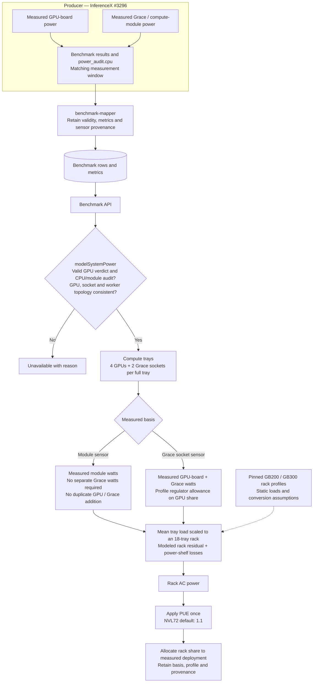
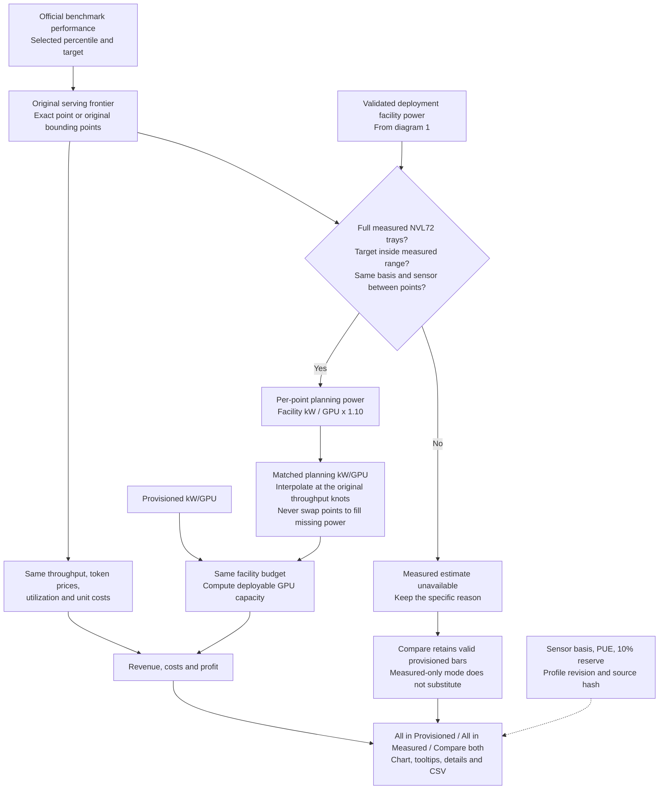

# PowerX system power and smart provisioning

[English](./powerx-system-power.md) | [简体中文](./powerx-system-power.zh.md)

PowerX starts with benchmark measurements and estimates how much facility power
is needed to run the measured workload. Smart provisioning uses that estimate to
calculate capacity and economics for a fixed facility power budget.
[PR #1190](https://github.com/SemiAnalysisAI/InferenceX-app/pull/1190) extends this
path to GB200/GB300 NVL72 racks. It also preserves valid provisioned comparisons
when the corresponding measured estimate is unavailable.

The ordinary modeled-power chart supports the non-agentic 8192-input/1024-output
workload. The Profit Estimator explicitly opts into AgentX estimates, including
Kimi K3; that does not establish AgentX calibration. The app, derived views API,
and offline exporter reuse the model. The producer and raw benchmark API retain
the original measurements.

Start with [the Kimi K3 example](#why-kimi-k3-can-have-power-data-but-no-smart-provisioning-row),
then [the worked calculation](#a-worked-nvl72-calculation). The
[architecture diagrams](#nvl72-architecture-walkthrough) and
[code map](#where-each-part-lives) connect the explanation to implementation.
The later sections retain the full admission, topology and export contracts.

`system-power-model.profiles.json` records the pinned power model revision,
component source hashes, hardware mapping, complete platform configuration, and
fixed inference assumptions. Its profiles come from executing the original
Python components. `system-power-model.ts` preserves their nonlinear fan curve,
PSU efficiency interpolation, intermediate rounding, and PUE ordering. The
Python-generated reference cases test this implementation against the source.

The pinned source currently identifies itself as **DRAFT / pending human
verification**. Numerical parity establishes implementation equivalence, not
empirical chassis calibration.

## What is measured, modeled, and provisioned?

These are different inputs to a calculation, not interchangeable labels:

| Quantity                    | Meaning                                                    | Used for                                                         |
| --------------------------- | ---------------------------------------------------------- | ---------------------------------------------------------------- |
| GPU Level Measured          | Validated GPU-board watts during the benchmark window      | GPU power charts and the measured GPU input to system modeling   |
| GPU Level Provisioned (TDP) | The configured hardware TDP reference                      | GPU-level reference comparisons; not a measurement of this run   |
| All in Provisioned          | The hardware registry's fixed facility kW/GPU allowance    | Baseline capacity and profit planning                            |
| All in Measured             | Measured inputs plus modeled unmeasured components and PUE | Workload-dependent system-power estimates and smart provisioning |

“All in Measured” still includes modeled components. The chart must retain that
qualification. Smart provisioning changes the estimated GPU capacity per GW;
it does not set GPU power limits or prove that average power plus a reserve is a
safe electrical peak limit.

The seven eight-GPU chassis profiles measure GPU boards and model CPU, DRAM and
other chassis overhead. **NVL72 has a different boundary:** it requires measured
compute-module power, or measured GPU-board power plus complete Grace-socket
power. Grace and its LPDDR5X are not filled in with a CPU utilization estimate.
Rack networking, switches, tray residuals and conversion losses are modeled.

## Why Kimi K3 can have power data but no smart-provisioning row

A GPU-power chart answers “what GPU power was measured?” The profit calculation
answers “what whole-system power belongs to the performance point that serves
this target?” A visible GPU measurement is only one of those required inputs.

The September 29, 2026 reproduction used 93 saved public Kimi K3 benchmark rows,
AgentX P90 at **45 tok/s/user**, and automatic FP4 selection. It reproduced the
reported two priced configurations: B200 Dynamo-vLLM and MI355X ATOM. This is a
historical reproduction of the reported screenshot, not a statement that today's
live database has the same coverage. At #1190 head
[cc86afd6](https://github.com/SemiAnalysisAI/InferenceX-app/commit/cc86afd6b179cceeb550cbf579ff60df46a47ac3),
the model and admission rules explain those saved inputs as follows:

| Configuration | Why GPU data does not produce a measured profit estimate                                                                                                            | Work needed                                                                                                                                                                                                |
| ------------- | ------------------------------------------------------------------------------------------------------------------------------------------------------------------- | ---------------------------------------------------------------------------------------------------------------------------------------------------------------------------------------------------------- |
| GB200 NVL72   | The 13 saved rows had valid GPU power but no accepted CPU/module metrics or CPU audit. #1190 supplies the rack model, but cannot supply those missing measurements. | Collect complete Grace/module and GPU telemetry for the same benchmark windows, validate it, and ingest the matched results.                                                                               |
| GB300 NVL72   | The 11 saved rows had no CPU/module evidence; only five had valid GPU power. The selected frontier also used GPU-invalid row 442101.                                | Recover valid GPU evidence where retained artifacts permit it, and obtain the missing Grace/module measurements. Both requirements must pass.                                                              |
| MI355X vLLM   | The original performance bracket used rows 443223 and 443220; 443220 had invalid power. Other valid GPU-power points belonged to a different bracket.               | Diagnose the original point's retained telemetry. Reprocess only if it contains sufficient valid evidence; otherwise collect and publish replacement benchmark results with matched performance and power. |
| B300          | The selected rows 439941/439935 had no measured power.                                                                                                              | Supply qualified measurements for the serving curve used by the estimator.                                                                                                                                 |
| H200          | The available serving curve did not reach the requested 45 tok/s/user.                                                                                              | Use a target inside that curve's supported range, or obtain a qualified curve covering the requested target.                                                                                               |

The screenshots also selected different engines: the power chart hid ATOM and
showed MI355X vLLM, while the priced AMD result was ATOM. Comparisons must match
model, workload, date/run, engine, precision, percentile and target before their
row counts are compared.

The AMD example is concrete: the performance interpolation at 45 uses
**14.832 and 47.596 tok/s/user**, with invalid power at the second point. A valid
power sample at **60.386 tok/s/user** cannot replace it without also changing
which performance points support the estimate. Filtering out all bad-power rows
and rebuilding the frontier would define a different comparison methodology.
#1190 deliberately retains the original serving frontier.

The saved invalid rows do not identify the collection failure's cause. Their
public audit field was null, so this evidence does not justify blaming an
exporter, deleting all AMD history, or promising that re-ingestion will repair
it. New CPU readings from another run also cannot be attached to historical
throughput results.

### What #1190 fixes, and the remaining fix

The PR fixes the unsupported NVL72 topology, validates the two accepted sensor
boundaries, and keeps a valid **All in Provisioned** result in **Compare both**
when the measured estimate is absent. It already emits a specific skip reason;
**All in Measured** alone continues to omit unqualified numeric results.

The existing collapsed **Unavailable estimates** disclosure already lists each
configuration and its reason. A possible presentation follow-up is to make that
information easier to find beside the results and link each entry to its
measurement or target. This is a proposed improvement, not behavior added by
this document. It should not turn missing measurements into zeroes or
provisioned values under a measured label.

To produce the missing numeric rows, first inspect the original run artifacts.
If the required samples and provenance exist, validate and reprocess those same
windows. If they were never collected, collect a replacement performance-and-power
result together. Complete Grace/module coverage is required for NVL72; fixing
only the rack model or only GPU validity is insufficient.

## A worked NVL72 calculation

This is an **illustrative reference fixture, not a measured Kimi K3 result**.
Use the stored GB300 module-basis case with **3,000.75 W per complete tray**,
four GPUs and two Grace sockets per tray, and PUE 1.1. A real admitted benchmark
must separately pass the GPU and CPU/module audit checks described below.

1. **Choose the sensor boundary.** Here the module reading already covers the
   GPU/Grace compute module, so the model does not add GPU or Grace watts again.
   On the alternative GPU-plus-Grace path, the current profile adds the measured
   GPU and Grace totals, then a regulator allowance of GPU watts × 0.15 / 0.85.
   That allowance is a model assumption, not an independently measured rail.
2. **Evaluate one rack.** Replicate the measured mean across 18 compute trays,
   add the profile's tray components and nine NVSwitch trays, then apply tray
   conversion losses and two management switches. Evaluate the power-shelf
   efficiency at this combined load, rather than evaluating a separate rack for
   each measured tray.
3. **Apply facility overhead once.** Multiply rounded rack AC power by PUE.
   Allocate the resulting rack share over 72 GPUs. This assumes a rack whose
   remaining trays run at the measured trays' mean load; it does not measure
   the actual occupancy or power of an entire rack.
4. **Apply planning headroom separately.** Multiply facility kW/GPU by 1.10.
   PUE 1.1 and the 10% reserve are different factors with different purposes.

The committed Python reference fixture contains these intermediate values:

| Stage                                          |    Watts |
| ---------------------------------------------- | -------: |
| Measured module input × 18 trays               | 54,013.5 |
| Modeled compute-tray components                | 11,466.0 |
| Modeled NVSwitch trays                         |  4,107.6 |
| Tray conversion losses                         |  1,967.8 |
| Rack DC, including 200 W management switches   | 71,754.9 |
| Rack AC, after load-dependent shelf efficiency | 74,904.6 |
| Facility power after PUE 1.1                   | 82,395.1 |

Displayed intermediate values are rounded. The calculation retains the source's
summation and rounding order, so adding displayed values can differ by 0.1 W.
The source's raw profile defaults include PUE 1.2; the dashboard wrapper supplies
**1.1 for NVL72** and **1.3 for the supported air-cooled chassis**.

    Planning kW/GPU = 82,395.1 / 72 / 1,000 × 1.10 ≈ 1.258814
    GPU capacity per GW = 1,000,000 / 1.258814 ≈ 794,399
    GPU-hours per GW-year = GPU capacity × 8,760

For an eight-GPU benchmark on two full trays, the assigned facility share would
be 82,395.1 × 8 / 72 ≈ 9,155.0 W. Dividing that share by the eight measured GPUs
gives the same per-GPU planning value. The estimator does not claim that this
small benchmark measured all 72 GPUs.

At a non-exact interactivity target, the existing performance frontier determines
the two bounding benchmark points. Both must have valid planning power and the
same model revision, PUE, topology and sensor basis. The code linearly
interpolates planning kW/GPU between those original points. It does not replace
the existing throughput interpolation or extrapolate beyond its measured range.

The economics then reuse the same throughput, token-price schedule, utilization,
license share and per-GPU-hour cost in both power modes:

    Revenue = revenue per active GPU-hour × GPU-hours × utilization
    Cost = cost per GPU-hour × GPU-hours
    License share = revenue × license fraction
    Profit = revenue − cost − license share

Changing planning power changes capacity and therefore total revenue, cost and
profit per GW. Under these fixed per-GPU assumptions it does not improve profit
margin, throughput per GPU, or profit per chip-hour. This is a planning projection,
not a prediction that workload behavior will remain unchanged at facility scale.

## Where each part lives

The links below are repository-relative so they follow the reviewed checkout.
The walkthrough was checked against app head cc86afd6; the example comes from
the committed reference JSON. No new hardware measurements were taken for it.

| Responsibility                                                                      | Implementation                                                                                                                                                                                                                                                                                                |
| ----------------------------------------------------------------------------------- | ------------------------------------------------------------------------------------------------------------------------------------------------------------------------------------------------------------------------------------------------------------------------------------------------------------- |
| Preserve CPU/GPU metrics and audit provenance during ingest                         | [benchmark-mapper.ts](../packages/db/src/etl/benchmark-mapper.ts), [power-publication.ts](../packages/db/src/etl/power-publication.ts)                                                                                                                                                                        |
| Pin Python model revision, assumptions and component hashes                         | [generate-system-power-reference.py](../packages/app/scripts/generate-system-power-reference.py), [profiles](../packages/app/src/lib/system-power-model.profiles.json)                                                                                                                                        |
| Apply workload, validity, sensor and topology admission; allocate deployment shares | [modelSystemPower](../packages/app/src/lib/modeled-system-power.ts)                                                                                                                                                                                                                                           |
| Calculate nonlinear chassis/rack power, losses and PUE                              | [system-power-model.ts](../packages/app/src/lib/system-power-model.ts)                                                                                                                                                                                                                                        |
| Match power to the original frontier and retain provisioned comparisons             | [modeledPowerAtTarget / estimateProfitByPower](../packages/app/src/components/calculator/profit-power.ts)                                                                                                                                                                                                     |
| Convert planning kW/GPU into capacity, revenue, cost and profit                     | [profit-estimator.ts](../packages/app/src/components/calculator/profit-estimator.ts)                                                                                                                                                                                                                          |
| Display values, provenance, unavailable reasons and CSV fields                      | [ProfitEstimatorDisplay.tsx](../packages/app/src/components/calculator/ProfitEstimatorDisplay.tsx), [ProfitEstimatorChart.tsx](../packages/app/src/components/calculator/ProfitEstimatorChart.tsx)                                                                                                            |
| Reuse the same economics through the read-only views API                            | [calculator-extensions.ts](../packages/app/src/lib/views-api/calculator-extensions.ts)                                                                                                                                                                                                                        |
| Export modeled benchmark rows offline                                               | [export-modeled-system-power.ts](../packages/app/scripts/export-modeled-system-power.ts)                                                                                                                                                                                                                      |
| Check calculation parity and admission behavior                                     | [reference fixtures](../packages/app/src/lib/system-power-model.reference.json), [model tests](../packages/app/src/lib/system-power-model.test.ts), [admission tests](../packages/app/src/lib/modeled-system-power.test.ts), [planning tests](../packages/app/src/components/calculator/profit-power.test.ts) |

Publishing #1190 publishes its TypeScript implementation and bundled profiles;
the runtime does not fetch Python from GitHub. The Python source pin is local commit
`6fcc086b77576d4cecb9d0c79637d6daf980308c`, intended for the private
[SemiAnalysisAI/inferencex_power_model](https://github.com/SemiAnalysisAI/inferencex_power_model)
repository. That commit is **unpublished pending repository write access**;
reviewers cannot yet retrieve it from that remote. Publishing the app bundle
does not publish the Python source. Source publication, when completed, will not
change its DRAFT status or establish empirical calibration. The source
revision and file hashes belong in the review/export record, alongside which
components remain uncalibrated. See the update procedure below for historical
results and frozen exports.

## NVL72 architecture walkthrough

### Measurements, ingestion and system power



A valid module sensor already covers GPU, HBM, Grace and LPDDR5X; that path
requires the complete module/socket audit but no redundant Grace-watts fields.
The GPU-plus-Grace path instead requires valid socket measurements. Neither
path substitutes a CPU estimate for missing CPU/module telemetry. A present but
invalid module measurement is unavailable rather than silently falling back.

### Planning, comparison and output



Solid arrows show data flow; dashed arrows supply assumptions or provenance.
Planning uses official frontier points, not `?unofficialrun=` overlays. The
NVL72 model supplies a system-power calculation; it does not create missing
measurements or choose new performance points. The detailed gates below also
cover eight-GPU chassis and their existing replica extrapolation.

## Updating the model for historical results

Modeled power is derived from retained measurements when the browser or a shared
views API transforms a benchmark row. Changing the model does not rewrite the
original GPU measurements or require a per-run database backfill.

1. Commit and publish the intended Python model revision so another reviewer can
   obtain the exact source. Update `REVISION` in
   `packages/app/scripts/generate-system-power-reference.py` to that clean commit,
   update `REVISION_STATUS`, and update the recorded assumptions when required.
   Publishing Python alone does not update the dashboard's bundled profiles.
2. Run that script with the path to the pinned model checkout to regenerate
   `system-power-model.profiles.json` and `system-power-model.reference.json`.
   If equations or load-dependent components changed, update the TypeScript
   implementation too; regenerating constants alone is insufficient.
3. Run the system-power model parity and admission tests, then deploy the app.
   Existing browser sessions need the updated bundle. Derived API responses need
   the normal authenticated cache invalidation or cache expiry; deployment alone
   does not establish that every cached response uses the new revision.
4. Regenerate frozen CSV/JSON exports separately. If the revised model needs
   inputs that were never recorded, those rows stay unavailable until the input
   gap is resolved. A new benchmark's power must not be attached to an older
   benchmark's throughput.

## Boundary and assumptions

The input is measured mean GPU power during a validated serving window. The
modeled chassis AC output adds the source model's CPU, DRAM, networking, storage,
board, fans, and PSU conversion losses. Facility power is a separate estimate:
PUE is applied after chassis AC, including the source's rounding order.

The fixed README inference sweep uses `u_cpu=0.20`, `u_ram=0.20`, `u_pcie=0.05`,
and `u_nvme=0.0`. The pinned Python model defaults to PUE `1.2`; PowerX uses
`1.3` for its supported air-cooled chassis profiles. Utility power = critical IT
power × PUE (`1.3` air, `1.1` DLC).
The factor applies after chassis AC; measured GPU power and chassis AC do not change.
Cooling describes the modeled chassis, not verified benchmark-site cooling.
The chassis profiles do not model DLC; `--pue` remains an explicit facility-factor
override and does not convert an air-cooled chassis model into a DLC model. The
NVL72 rack profiles below are direct-liquid-cooled and default to `1.1`.
Platform-specific network assumptions,
fan control, component counts, and chassis defaults are preserved in the
generated profile; every JSON export includes that profile and every CSV row
includes its applicable assumptions and profile hash. These are model inputs,
not measured CPU/DRAM utilization.

| Hardware identity | Source chassis implementation                                 |
| ----------------- | ------------------------------------------------------------- |
| `h100`            | `human_verified/hgx_h100_chassis/h100_chassis_power_model.py` |
| `h200`            | `human_verified/hgx_h200_chassis/h200_chassis_power_model.py` |
| `b200`            | `human_verified/hgx_b200_chassis/b200_chassis_power_model.py` |
| `b300`            | `human_verified/hgx_b300_chassis/b300_chassis_power_model.py` |
| `mi300x`          | `human_verified/mi300x_chassis/mi300x_chassis_power_model.py` |
| `mi325x`          | `human_verified/mi325x_chassis/mi325x_chassis_power_model.py` |
| `mi355x`          | `human_verified/mi355x_chassis/mi355x_chassis_power_model.py` |

All listed profiles describe a complete eight-GPU chassis. Their topology is not
substituted onto GB200 or GB300, which use the NVL72 rack profiles instead:

| Hardware identity | Source rack implementation                                        |
| ----------------- | ----------------------------------------------------------------- |
| `gb200`           | `human_verified/gb200_nvl72_rack/gb200_nvl72_rack_power_model.py` |
| `gb300`           | same module, `gb300_nvl72_rack_config`                            |

The rack profiles (`rackProfiles`) take **measured** compute-module watts per tray
as their input: the module sensor total (`avg_total_module_power_w`) when the
producer publishes it, otherwise GPU-board watts plus the Grace-socket total
(`avg_total_cpu_power_w`) with the source's regulator-loss allowance on the GPU
share. The Grace CPU and LPDDR5X are never modelled; rows without
`cpu_power_valid=1` and complete module or Grace provenance stay unavailable (`cpu-telemetry`).
Each measured worker host is one compute tray (four GPUs, two Grace sockets); an
aggregate multinode row without a per-worker array is `gpuCount / 4` trays at the
deployment mean, cross-checked against the Grace-socket count and the CPU leg's
`power_audit.cpu.observed_sockets`. The
measured trays are folded into one rack of 18 trays matching their mean
compute-module input, the power-shelf efficiency curve is evaluated once at that
rack's DC load (as the source `gb200_nvl72_rack_power` does with its single
per-tray input), and every tray takes the same 1/18 share, so NVSwitch trays,
power shelves, and management switches are amortised over 72 GPUs. Chassis, by
contrast, own their fans and PSUs and are each evaluated at their own load. The
result carries `topologyBasis: 'nvl72-trays'`, `measuredBasis`, and `sensorKind`.
A partially allocated tray extrapolates only the GPU-board share (a module reading
already covers the whole tray) and is labeled `extrapolated`. The source is pinned to revision
`6fcc086b77576d4cecb9d0c79637d6daf980308c`, a local commit intended for the private
model repository linked above. It remains unpublished pending repository write
access, and the model remains DRAFT / pending human verification. The NVL72 section below
lists the measured input, the modeled residual and the Profit Estimator gate rules.

A partially allocated chassis (one to seven measured GPUs on one host) is
modeled at measured per-GPU power × 8. That is the same `n_gpu × W/GPU` input
the source sweep scripts feed each chassis model, and it assumes the unmeasured
GPUs run the same workload. The estimate is labeled `chassisBasis:
'extrapolated'`: per-GPU values divide by the modeled chassis GPU count
(`modeledGpuCount`), while `deploymentAcWatts` / `deploymentFacilityWatts` keep
only the measured GPUs' share of each chassis. This is not a proportional share
of a chassis evaluated at partial load; fixed components, the fan curve, and PSU
efficiency are all evaluated at full-chassis load. Missing or invalid telemetry,
inconsistent counts, missing host placement, more than one chassis per host, and
model-domain overflow remain unavailable.

For a single-node deployment, the producer's physical width is `TP * PP * PCP`.
EP partitions that width. Some existing API configuration aliases contain
`TP * EP`; the model cross-checks the physical width against measured total and
per-GPU watts instead of trusting or summing those aliases. Multi-node and
disaggregated inputs require one chassis (one to eight GPUs) per measured
worker, distinct worker hosts, and consistent total/role watts. A role average
alone cannot establish physical placement or evaluate each host's nonlinear
model. CPU-only frontend workers are excluded from GPU-chassis counting. Separate CPU-only
frontend/router hosts are outside this estimate; CPU power within GPU chassis
still uses the source's fixed 20% utilization assumption.

The default measured contract is numeric `power_valid=1` and metric schema 2.
The original validated single-node producer predates the schema marker but
already defines both watts fields identically. This path retains the absent
schema and reports `validated-unversioned-single-node`; it does not upgrade the
source or admit unversioned disaggregated power. The article receipt additionally
pins the producer checkout and retains each original audit artifact.

## NVL72 rack estimate (GB200, GB300)

**Measured input.** Every compute tray is fed a measured compute-module figure; the
Grace CPU and LPDDR5X are never modeled. The producer's CPU power leg (srt-slurm,
ACPI hwmon) publishes, over the same formal window as GPU energy,
`avg_cpu_socket_power_w`, `avg_total_cpu_power_w`, `total_cpu_energy_j`, and, when
the `Module Power Socket` sensor exists on every socket, `avg_total_module_power_w`
and `total_module_energy_j`, with the independent verdict `cpu_power_valid` and the
`power_audit.cpu` block (sensor kind, collector, socket coverage, reason codes).
Admission requires `power_valid=1`, schema 2, `cpu_power_valid=1`, and
`power_audit.cpu` with matching expected/observed socket counts: two per tray.
A module reading requires `sensor_kind: module` and does not need redundant Grace
metrics. The GPU-plus-Grace path requires `sensor_kind: grace_socket`, positive
Grace watts and total/mean watts consistent with the audited socket count.
CPU-rail-only and missing or unknown sensor provenance stay unavailable. Basis selection: `module` when `avg_total_module_power_w` is present (the
reading already contains the GPU boards, so it is never scaled), otherwise
`gpu-plus-grace` (GPU-board watts × 4 plus the Grace-socket total per tray, with the
source's regulator-loss allowance `regulatorLossFracOfTdp / (1 − frac)` on the GPU
share only). A present-but-invalid module key makes the row unavailable
(`cpu-telemetry`); it never falls back to the Grace socket silently.

**Modeled residual.** Everything outside the compute modules comes from the pinned
profile (`rackProfiles`), evaluated once for a rack of 18 trays at the measured
trays' mean input (the shelf curve sees the whole rack's DC load, never one tray's)
and amortised over 72 GPUs; the parameters marked UNVERIFIED carry a documented
range in `unverifiedParameters` and no published rail:

| Component (per rack unless noted)      | GB200                                                                                | GB300                                                                    | Source status                            |
| -------------------------------------- | ------------------------------------------------------------------------------------ | ------------------------------------------------------------------------ | ---------------------------------------- |
| NVSwitch tray silicon (9 trays)        | 406.4 W / tray at `u_nvlink` 0.5                                                     | same                                                                     | `blackwell_nvswitch` model               |
| NVSwitch tray residual                 | 50 W / tray                                                                          | same                                                                     | UNVERIFIED (20–80 W)                     |
| Compute-tray NICs with optics          | ConnectX-7, 4 × 31.5 W = 126 W / tray                                                | ConnectX-8 integrated PCIe, 4 NICs totaling 315 W (78.8 W each, rounded) | `generic/connectx7`, `generic/connectx8` |
| Compute-tray BlueField-3 DPUs          | 2 × 65 W idle = 130 W / tray                                                         | same                                                                     | `generic/dpu`, idle only                 |
| Compute-tray NVMe                      | 22 W / tray idle                                                                     | same                                                                     | `generic/nvme`, idle only                |
| Compute-tray fans                      | 130 W / tray                                                                         | same                                                                     | UNVERIFIED (40–220 W)                    |
| Compute-tray board residual            | 40 W / tray                                                                          | same                                                                     | UNVERIFIED (20–60 W)                     |
| Management switches                    | 2 × 100 W                                                                            | same                                                                     | profile constant                         |
| Tray 50 V → 12 V conversion            | efficiency 0.9725 on tray loads                                                      | same                                                                     | UNVERIFIED (0.96–0.985)                  |
| Regulator allowance (`gpu-plus-grace`) | GPU-board W × 0.15 / 0.85; GPU share only                                            | same                                                                     | Grace tuning guide                       |
| Power shelf                            | 264 kW installed, 132 kW redundant; efficiency 0.90 → 0.94 → 0.965 at 10/20/30% load | same                                                                     | profile curve                            |
| Facility PUE                           | 1.1 (direct liquid cooling)                                                          | same                                                                     | PowerX policy, applied once to rack AC   |

Rack DC above the installed shelf capacity (264 kW) overflows the efficiency curve
and the row is unavailable (`model-domain`). Rounding follows the source: rack AC is rounded
to 0.1 W before PUE. Python-generated `rackCases` prove parity with the pinned
implementation for both variants, both bases, every shelf knot and PUE 1.0–1.2.

**Gate rules (Profit Estimator).** Planning kW/GPU = deployment facility watts ÷
measured GPUs ÷ 1000 × 1.1. It accepts fully measured eight-GPU chassis
(`chassisBasis: 'full'` on the `single-node`, `worker-hosts`, or `uniform-hosts`
basis; see the Profit Estimator power basis section), or an `nvl72-trays` estimate
whose trays are all fully measured (four GPUs and two sockets each: one tray per
measured worker host, or, for an aggregate multinode row without a per-worker
array, `gpuCount / 4` trays at the deployment mean, cross-checked against the
Grace-socket count and `power_audit.cpu.observed_sockets`). Partial trays are
extrapolated in the chart but rejected here. Single-node 1/2/4-GPU chassis
allocations use the replica extrapolation below. Between two
frontier knots both must share the same measured basis and sensor kind; a module
knot beside a Grace-socket knot stays unavailable rather than blending sensors. The
bar tooltip, the collapsed Power assumptions disclosure and the CSV columns `Power
basis`, `Power sensor`, `System power profile` name the basis (measured module, or
measured GPU board + Grace socket with regulator loss modeled), the sensor kind, and
the pinned profile (`modelPath @ modelRevision sha256:<source file hash>`) per row.
The `?unofficialrun=` overlay rule does not apply to the Profit Estimator basis
control: the estimator prices official frontier points only.

## Profit Estimator power basis

The per-GW Profit Estimator offers provisioned power, measured + modeled power,
and a paired comparison in Benchmark Config. Provisioned remains the default.
The control uses the existing insider feature gate and is hidden while locked.
Unlock with ↑↑↓↓ (`inferencex-feature-gate=1` in local storage). While locked,
`c_power` cannot activate an alternative calculation or fetch full power rows;
relocking restores provisioned estimates immediately.
The alternative reuses the same hardware, P90 target, throughput frontier,
token mix, prices, utilization, and per-GPU-hour costs. It changes only the
facility kW/GPU used to calculate capacity per GW. Consequently, revenue,
compute expense, license fee, and profit scale together; profit margin does not
change. Electricity expense is not recomputed separately.

This opt-in AgentX estimate requires validated schema-v2 telemetry and a supported
system profile. It accepts full eight-GPU chassis on the single-node or measured
worker-host basis. Aggregate multinode rows without per-worker telemetry may use
the explicit `uniform-hosts` assumption: each complete chassis is evaluated at
the measured deployment-mean GPU watts. Disaggregated rows require per-host role
power. NVL72 requires complete four-GPU trays with the CPU provenance above.

Validated single-node 1/2/4-GPU allocations retain full-chassis extrapolation:
fill an eight-GPU server with whole replicas at the measured per-GPU power and
throughput, then divide modeled facility power by eight. This assumes replica
co-location does not change performance or power; it is not a measurement of a
partly idle server. The chart, tooltip, and CSV label every extrapolated estimate,
including interpolation with one partial knot. Other partial layouts and missing
or invalid measurements remain unavailable with distinct reasons.
The ordinary 8K/1K transformation keeps its existing admission policy.

Compare retains each valid provisioned estimate even when measured + modeled
power is unavailable. Its notice identifies the missing measured estimate;
modeled-only mode never substitutes provisioned watts.

At an exact frontier point, use that point's modeled power. Between points,
estimate power linearly using the same two knots as the existing throughput
interpolation; never select a different point to fill a power gap, and never blend
two knots measured on different bases. The estimate uses PowerX's PUE policy (1.3 for
air-cooled chassis, 1.1 for DLC NVL72 racks) and an additional 10% planning margin.
These assumptions, including the fixed CPU/DRAM utilization above, are not validated
peak-load provisioning or AgentX system calibration. The UI keeps a short measured-versus-modeled note visible; detailed assumptions
and NVL72 measured inputs are in a collapsed disclosure. The CSV retains the full
assumptions and, per row, the measured basis, sensor kind and profile.
`c_power=modeled` and `c_power=compare` preserve the selection in share URLs.
Unavailable historical estimates use the hardware registry when a chip is absent
from today's results and include the source date/run label.

## Offline comparison export

The exporter reads a local cohort envelope and writes a **new** output directory:

```sh
bun packages/app/scripts/export-modeled-system-power.ts \
  --input /path/to/original-qwen-article.input.json \
  --output /path/to/new-original-qwen-comparison

bun packages/app/scripts/export-modeled-system-power.ts \
  --input /path/to/qwen35-current.input.json \
  --output /path/to/new-current-qwen-comparison --pue 1.3
```

Without `--pue`, each row uses the dashboard's default for its hardware (`1.3` for
the air-cooled chassis profiles, `1.1` for the DLC NVL72 rack profiles) through the
same `modelSystemPower` path the chart uses, so article figures match chart hovers;
`metadata.pue_override` records an explicit `--pue`, which then applies to every
row, and `metadata.pue_defaults` records the per-hardware defaults. NVL72 rows also
carry `measured_basis`, `sensor_kind`, the Grace-socket and module measured inputs
under their own `cpu_power_valid`, the rack profile's `model_path` and assumptions,
and rack-specific `calculation_boundary` / `extrapolation_note` text; x86 rows are
unchanged.

The maintained input shape is `ComparisonInput` in the script:

```ts
{
  cohort: string,
  metadata: { /* source URLs, capture times, hashes and cohort selection */ },
  rows: [{
    id: string,               // stable observation identity
    cell?: string,            // optional group of original replicates
    benchmark: BenchmarkRow, // original API row or existing ETL output
    rawInput?: unknown,      // original artifact before ETL normalization
    source?: object,         // run, attempt, producer revision and artifact receipt
    audit?: object           // matching original power-validation sidecar
  }]
}
```

Use the existing `normalizeArtifactRows` / `mapBenchmarkRow` for raw producer
aggregates. Keep the original aggregate as `rawInput`, retain original schema
markers, and check that its measured metrics survive normalization unchanged.
Use complete raw API responses for current snapshots, then select the exact
`single_turn`, `isl=8192`, `osl=1024` workload locally. Retain every scoped row,
including unsupported hardware and missing/invalid power; never mix a current
snapshot into the frozen article campaign.

Outputs are `comparison.json`, `comparison.csv`, and optional `cells.csv`.
The JSON includes original input rows, measured validity, modeled outputs,
assumptions, audit windows, and source provenance. CSV includes separate measured
and modeled columns; unavailable numbers are blank. Invalid/unverified raw
values remain in the raw-input record and are not labeled valid measurements.
Metadata records input and implementation SHA-256 hashes, model and application
revisions, worktree state, generation time, and full profile provenance. Generate
the final release export from the intended application commit; file hashes also
identify any local changes during development.

Modeled energy is available only when a matching valid audit sidecar supplies an
exact telemetry duration, physical GPU count, and successful request/token
denominators. It is modeled deployment power (the measured GPUs' share of each
chassis) multiplied by that duration, not a time integral of measured wall power. Actual output-token counts are used;
nominal `1024` tokens per query never replace recorded counts. No kernel-level
prefill/decode energy is inferred. API snapshots without these sidecars receive
power estimates only.

Each replicate is modeled before aggregation. A cell mean averages its modeled
replicate outputs; it does not evaluate the model at mean watts. If any replicate
is unavailable, the corresponding mean remains unavailable rather than silently
dropping that replicate.

## Measured P75 and P90 GPU power

`y_measuredP75Power` and `y_measuredP90Power` show the time-weighted P75 and P90 of
synchronized fleet GPU-board power over the validated load window, divided by GPU
count. They share the regular measured-power chart path for official points and
unofficial overlays. Missing or unvalidated percentile data remains unavailable;
average power is never used as a substitute. These metrics are separate from modeled
chassis AC power and individual-device percentiles.

P75 and P90 backfills use the same 34 original validated traces and exact windows
recorded in `docs/data/power-p90-backfill.json`.
