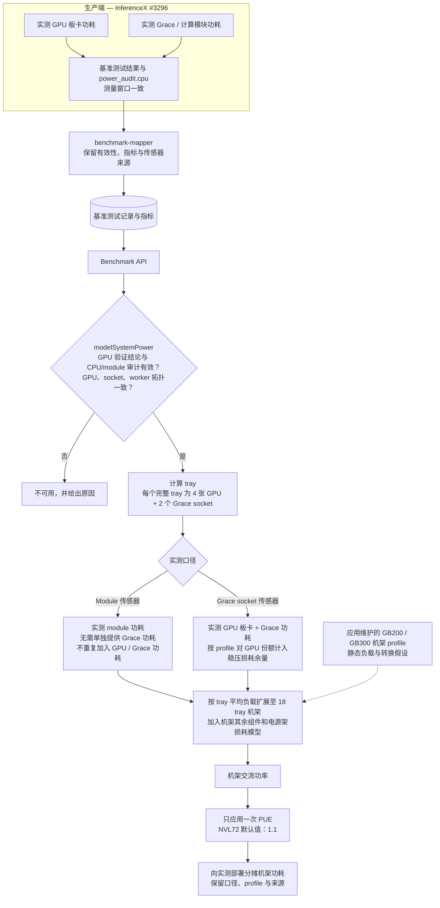
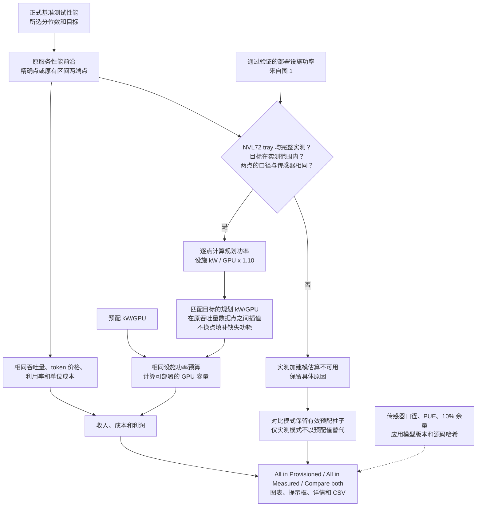

# PowerX 系统功耗与智能容量规划

[English](./powerx-system-power.md) | [简体中文](./powerx-system-power.zh.md)

PowerX 以基准测试的实测数据为起点，估算运行该负载所需的设施功率。智能容量规划
（smart provisioning）再根据这一估算，计算固定设施功率预算下的 GPU 容量及经济指标。
[PR #1190](https://github.com/SemiAnalysisAI/InferenceX-app/pull/1190) 将这条路径扩展到
GB200/GB300 NVL72 机架。当相应的实测加建模估算不可用时，对比模式仍保留有效的预配结果。

常规建模功耗图支持非 AgentX 的 8192 输入 / 1024 输出负载。利润估算器显式启用
AgentX 估算，包括 Kimi K3；这不代表模型已经过 AgentX 校准。应用、派生 views API
和离线导出器共用同一模型。生产端和原始 benchmark API 保留原始测量值。

建议先看 [Kimi K3 的例子](#为什么-kimi-k3-有-gpu-功耗却没有智能容量规划结果)，再看
[完整计算示例](#nvl72-计算示例)。[架构图](#nvl72-架构导览) 和
[代码位置](#各部分代码在哪里) 将说明与实现对应起来。后面的章节完整记录了数据接纳、
拓扑和导出约定。

模型由 InferenceX-app 维护。`system-power-model.ts` 定义公式，包括非线性风扇曲线、
PSU 效率插值、中间值舍入和 PUE 应用顺序。`system-power-model.profiles.json` 保存可
直接编辑的组件参数、硬件映射、平台配置，以及说明固定推理场景的元数据。前端、
共享 views API 和离线导出器均以这些仓库内文件中的模型定义为准。`system-power-model.provenance.json`
记录应用模型版本和源码哈希。

已提交的参考用例保留历史 Python 基线，用于回归对照；开发、构建和部署应用模型
都不需要 Python 或原私有仓库。模型仍为 **DRAFT / pending human verification
（草稿，待人工核验）**。与数值基线一致只能证明实现的一致性，不能证明已经过实机机箱校准。

## 实测、建模和预配分别指什么？

它们是计算中的不同输入，不能互换名称：

| 指标                        | 含义                                     | 用途                                     |
| --------------------------- | ---------------------------------------- | ---------------------------------------- |
| GPU Level Measured          | 基准测试窗口内通过验证的 GPU 板卡功率    | GPU 功耗图，以及系统模型的实测 GPU 输入  |
| GPU Level Provisioned (TDP) | 硬件配置中的 TDP 参考值                  | GPU 层面的参考对比；不是本次运行的测量值 |
| All in Provisioned          | 硬件注册表中固定的设施 kW/GPU 配额       | 容量和利润规划的基线                     |
| All in Measured             | 实测输入，加上未实测组件的模型估算及 PUE | 随负载变化的系统功耗估算和智能容量规划   |

“All in Measured” 仍包含建模组件，图表必须保留这一限定。智能容量规划改变的是每 GW
能容纳的 GPU 数量估算；它不会设置 GPU 功率上限，也不能证明“平均功耗加余量”就是
安全的供电峰值上限。

七种八卡机箱 profile 使用 GPU 板卡实测值，并对 CPU、DRAM 和其他机箱开销建模。
**NVL72 的测量边界不同：**它要求实测计算模块功耗，或实测 GPU 板卡功耗加上完整的
Grace socket 功耗。不能用 CPU 利用率假设补齐 Grace 及其 LPDDR5X 功耗。机架网络、
交换机、tray 其余组件和转换损耗由模型估算。

## 为什么 Kimi K3 有 GPU 功耗，却没有智能容量规划结果？

GPU 功耗图回答的是“测到了多少 GPU 功耗”；利润计算回答的是“满足这个性能目标的
数据点，对应多少整机功耗”。图上有 GPU 实测值，只能说明其中一项输入存在。

2026 年 9 月 29 日的复现使用了保存的 93 条公开 Kimi K3 基准测试记录，设置为 AgentX
P90、**45 tok/s/user**、自动选择 FP4。它复现了截图中两个有价格结果的配置：B200 Dynamo-vLLM
和 MI355X ATOM。这是对当时截图的历史复现，不代表今天的在线数据库仍有相同的数据覆盖。
按 #1190 的
[cc86afd6](https://github.com/SemiAnalysisAI/InferenceX-app/commit/cc86afd6b179cceeb550cbf579ff60df46a47ac3)
版本，其模型和接纳规则可以这样解释这批输入：

| 配置        | 为什么有 GPU 数据，却算不出实测加建模的利润结果                                                                          | 需要做什么                                                                                                 |
| ----------- | ------------------------------------------------------------------------------------------------------------------------ | ---------------------------------------------------------------------------------------------------------- |
| GB200 NVL72 | 保存的 13 条记录都有有效 GPU 功耗，但没有符合要求的 CPU/module 指标或 CPU 审计。#1190 提供了机架模型，无法补出缺失测量。 | 在相同基准测试窗口内采集完整 Grace/module 和 GPU 遥测，通过验证后将匹配的结果入库。                        |
| GB300 NVL72 | 保存的 11 条记录都没有 CPU/module 证据，其中只有五条 GPU 功耗有效。所选性能前沿还使用了 GPU 功耗无效的记录 442101。      | 若保留的产物足以证明 GPU 功耗有效，则恢复该证据；同时补齐 Grace/module 测量。两项要求都必须满足。          |
| MI355X vLLM | 原性能插值区间使用记录 443223 和 443220；443220 的功耗无效。其他功耗有效的数据点属于另一个区间。                         | 检查原数据点保留的遥测。只有存在充分有效证据时才重新处理；否则重新采集并发布性能与功耗匹配的基准测试结果。 |
| B300        | 所选记录 439941/439935 没有实测功耗。                                                                                    | 为估算器使用的服务性能曲线补充通过验证的测量。                                                             |
| H200        | 现有服务性能曲线达不到所要求的 45 tok/s/user。                                                                           | 将目标设在曲线支持的范围内，或取得覆盖该目标且通过验证的新曲线。                                           |

这些截图选择的引擎也不同：功耗图隐藏了 ATOM，显示 MI355X vLLM；有价格结果的 AMD
配置则是 ATOM。比较记录数量前，应先对齐模型、负载、日期/运行、引擎、精度、分位数
和目标值。

AMD 的例子更具体：45 tok/s/user 的性能插值使用 **14.832 和 47.596 tok/s/user** 两个点，
第二个点的功耗无效。不能直接借用 **60.386 tok/s/user** 处的有效功耗，否则支撑估算的
性能点也随之改变。如果先删掉所有功耗无效的记录，再重建前沿，就采用了另一套比较方法。
#1190 明确保留原有服务性能前沿。

保存的无效记录不能说明采集失败的原因：它们的公开审计字段为 null。因此，这份证据
不足以归咎于某个 exporter、删除全部 AMD 历史数据，或承诺重新入库就能修复。
也不能把另一轮运行新采集的 CPU 功耗附到历史吞吐量上。

### #1190 修复了什么，还缺什么？

该 PR 支持了原先不支持的 NVL72 拓扑，验证两种可接纳的传感器测量边界，并在实测
估算缺失时，让 **Compare both** 继续保留有效的 **All in Provisioned** 结果。
代码已经输出具体的跳过原因；单独选择 **All in Measured** 时，仍不显示不符合要求的数值。

现有默认折叠的 **Unavailable estimates** 详情已逐项列出配置及不可用原因。后续可以
改善展示，让读者更容易在结果旁找到这些信息，并跳转到对应测量或目标。这只是建议的
展示改进，不是本文新增的行为。不能把缺失测量改成零，也不能在实测标签下填入预配值。

要补齐缺失的数值结果，应先检查原运行的产物。若所需样本和来源记录齐全，就验证并
重新处理原测量窗口；若从未采集，则需要一起重测性能和功耗，形成替代结果。
NVL72 必须具备完整 Grace/module 覆盖；仅修机架模型或仅修 GPU 有效性都不够。

## NVL72 计算示例

以下是**用于说明计算过程的参考测试数据，不是 Kimi K3 实测结果**。采用已保存的 GB300
module 口径用例：**每个完整 tray 为 3,000.75 W**，每 tray 四张 GPU、两个 Grace socket，
PUE 为 1.1。真实基准测试还必须分别通过后文列出的 GPU 和 CPU/module 审计。

1. **确定传感器测量边界。**本例的 module 读数已包含 GPU/Grace 计算模块，模型不会再
   加一遍 GPU 或 Grace 功耗。另一条 GPU 加 Grace 路径则先相加两者的实测总功耗，再按
   GPU 功耗 × 0.15 / 0.85 加入稳压损耗余量。这个余量是模型假设，不是独立测得的供电轨功耗。
2. **计算一个整机架。**把实测均值扩展到 18 个计算 tray，加入 profile 中的 tray 组件和
   九个 NVSwitch tray，再计入 tray 转换损耗和两台管理交换机。在合计负载处计算电源架
   效率，而不是为每个实测 tray 单独计算一整套机架。
3. **只应用一次设施开销。**将舍入后的机架交流功率乘以 PUE，再按 72 张 GPU 分摊。
   这里假设机架其余 tray 的负载与实测 tray 的平均负载相同，并未测量整个机架的实际
   占用情况或总功耗。
4. **单独计入规划余量。**将设施 kW/GPU 乘以 1.10。PUE 1.1 与 10% 规划余量是不同
   的系数，作用也不同。

已提交的参考测试数据最初取自 Python 基线，包含以下中间值：

| 阶段                                       | 功率（W） |
| ------------------------------------------ | --------: |
| 实测 module 输入 × 18 个 tray              |  54,013.5 |
| 建模的计算 tray 组件                       |  11,466.0 |
| 建模的 NVSwitch tray                       |   4,107.6 |
| tray 转换损耗                              |   1,967.8 |
| 机架直流功率，含 200 W 管理交换机          |  71,754.9 |
| 计入随负载变化的电源架效率后的机架交流功率 |  74,904.6 |
| 乘以 PUE 1.1 后的设施功率                  |  82,395.1 |

表中中间值已舍入。计算保留模型的求和与舍入顺序，因此直接相加表中数值可能差
0.1 W。profile 的基线默认 PUE 为 1.2；仪表板封装层对 **NVL72 使用 1.1**，
对**当前支持的风冷机箱使用 1.3**。

    规划 kW/GPU = 82,395.1 / 72 / 1,000 × 1.10 ≈ 1.258814
    每 GW 的 GPU 容量 = 1,000,000 / 1.258814 ≈ 794,399
    每 GW 每年的 GPU 小时数 = GPU 容量 × 8,760

若基准测试使用两个完整 tray、共八张 GPU，则分摊的设施功率为
82,395.1 × 8 / 72 ≈ 9,155.0 W。再除以八张实测 GPU，得到的每 GPU 规划功率相同。
估算器并不声称这次小规模测试测量了全部 72 张 GPU。

当交互性能目标不恰好落在实测点上时，由现有性能前沿决定两侧的基准测试点。两点都
必须具备有效规划功率，且模型版本、PUE、拓扑和传感器口径相同。代码在原有两点之间
线性插值规划 kW/GPU，不替换原吞吐量插值，也不向实测范围之外外推。

随后，两种功耗模式共用相同的吞吐量、token 定价、利用率、模型许可分成和每 GPU 小时成本：

    收入 = 每个活跃 GPU 小时的收入 × GPU 小时数 × 利用率
    成本 = 每 GPU 小时成本 × GPU 小时数
    模型许可分成 = 收入 × 许可分成比例
    利润 = 收入 − 成本 − 模型许可分成

规划功率改变容量，因而改变每 GW 的总收入、总成本和总利润。在每 GPU 假设固定的
情况下，它不会提高利润率、每 GPU 吞吐量或每芯片小时利润。这是容量规划推算，
并不预测负载扩展到整个设施后仍保持相同行为。

## 各部分代码在哪里

以下链接均为仓库内相对链接，随当前检出的版本变化。本导览依据应用版本 cc86afd6
核对，示例来自已提交的参考 JSON；没有为本文新增硬件测量。

| 职责                                             | 实现                                                                                                                                                                                                                                                                                        |
| ------------------------------------------------ | ------------------------------------------------------------------------------------------------------------------------------------------------------------------------------------------------------------------------------------------------------------------------------------------- |
| 入库时保留 CPU/GPU 指标和审计来源                | [benchmark-mapper.ts](../packages/db/src/etl/benchmark-mapper.ts)、[power-publication.ts](../packages/db/src/etl/power-publication.ts)                                                                                                                                                      |
| 编辑组件参数；更新应用模型版本和源码哈希         | [profiles](../packages/app/src/lib/system-power-model.profiles.json)、[来源清单](../packages/app/src/lib/system-power-model.provenance.json)、[update-system-power-provenance.ts](../packages/app/scripts/update-system-power-provenance.ts)                                                |
| 检查负载、有效性、传感器和拓扑条件；分摊部署功耗 | [modelSystemPower](../packages/app/src/lib/modeled-system-power.ts)                                                                                                                                                                                                                         |
| 计算非线性机箱/机架功耗、损耗和 PUE              | [system-power-model.ts](../packages/app/src/lib/system-power-model.ts)                                                                                                                                                                                                                      |
| 将功耗匹配到原前沿，并保留预配对比结果           | [modeledPowerAtTarget / estimateProfitByPower](../packages/app/src/components/calculator/profit-power.ts)                                                                                                                                                                                   |
| 将规划 kW/GPU 换算为容量、收入、成本和利润       | [profit-estimator.ts](../packages/app/src/components/calculator/profit-estimator.ts)                                                                                                                                                                                                        |
| 显示数值、来源、不可用原因和 CSV 字段            | [ProfitEstimatorDisplay.tsx](../packages/app/src/components/calculator/ProfitEstimatorDisplay.tsx)、[ProfitEstimatorChart.tsx](../packages/app/src/components/calculator/ProfitEstimatorChart.tsx)                                                                                          |
| 通过只读 views API 复用同一经济指标计算          | [calculator-extensions.ts](../packages/app/src/lib/views-api/calculator-extensions.ts)                                                                                                                                                                                                      |
| 离线导出建模后的基准测试记录                     | [export-modeled-system-power.ts](../packages/app/scripts/export-modeled-system-power.ts)                                                                                                                                                                                                    |
| 验证计算一致性和接纳行为                         | [参考测试数据](../packages/app/src/lib/system-power-model.reference.json)、[模型测试](../packages/app/src/lib/system-power-model.test.ts)、[接纳规则测试](../packages/app/src/lib/modeled-system-power.test.ts)、[规划测试](../packages/app/src/components/calculator/profit-power.test.ts) |

公式和可编辑参数在 InferenceX-app 中一同审阅、一同发布。发布应用变更就会发布该
版本采用的模型，不需要单独发布 Python 源码，也不以私有仓库权限作为前提。
参考测试数据只将早期 Python 实现记作历史来源。后续变化由应用模型版本和文件哈希
标识；维护归属的改变或回归检查通过，都不代表完成了实测校准。历史结果和冻结导出
的更新方式见后文。

## NVL72 架构导览

### 测量、入库与系统功耗



有效的 module 传感器已覆盖 GPU、HBM、Grace 和 LPDDR5X；这条路径仍要求完整的
module/socket 审计，但无需重复提供 Grace 功耗字段。GPU 加 Grace 路径则要求有效的
socket 测量。两条路径都不会用 CPU 估算值补齐缺失的 CPU/module 遥测。
module 测量存在但无效时，结果保持不可用，不会悄然回退到另一条路径。

### 规划、对比与输出



实线表示数据流，虚线提供假设或来源信息。规划采用正式性能前沿点，不采用
`?unofficialrun=` 叠加层。NVL72 模型提供系统功耗计算，不会创造缺失测量，也不会重新
选择性能点。下文的详细接纳规则还涵盖八卡机箱及其现有的实例外推方式。

## 更新模型后，历史结果如何更新？

浏览器或共享 views API 转换基准测试记录时，会根据保留的测量值推导建模功耗。
修改模型不会改写原始 GPU 测量值，也不需要逐 run 回填数据库。

1. 在 `packages/app/src/lib/system-power-model.ts` 中修改公式，在
   `system-power-model.profiles.json` 中修改参与计算的参数：`fixedComponentsDcWatts`、
   `fan`、`psu` 及 `rackProfiles` 中的系数。每个 profile 的 `assumptions` 记录推导这些
   系数时采用的场景；只改 `u_cpu`、`u_ram` 等元数据，不会重新计算功率。要支持新的
   利用率场景，需要有依据的新系数或新公式、与之对应的假设记录，并通过回归验收。
   负载、有效性、拓扑和 PUE 策略位于 `modeled-system-power.ts`；若这些行为需要改变，
   应同步修改该适配层。三个文件都在 InferenceX-app 中审阅，无需另改一个模型仓库。
2. 用以下命令更新已提交的来源清单。`modelRevision` 的格式为 `app-sha256:<64 hex>`，
   根据上述三个文件实际内容的 SHA-256 哈希生成。`modelPath` 指向
   `packages/app/src/lib/system-power-model.ts`。更新后的清单应与模型修改一起提交；
   `--check` 只检查清单是否与当前文件一致，不写文件。这个哈希摘要是模型标识，
   不是 Git 提交。源码链接使用部署的 `VERCEL_GIT_COMMIT_SHA` 或 `GITHUB_SHA`，
   两者均缺失时使用 `master`。

   ```sh
   bun packages/app/scripts/update-system-power-provenance.ts
   bun packages/app/scripts/update-system-power-provenance.ts --check
   ```

3. 审阅数值变化，运行相关模型、接纳规则、规划、views API 和导出回归检查。
   保留 496 个历史参考用例作为冻结基线。有意改变模型时，需要提供独立论证的预期值，
   并明确验收回归结果；来源清单命令不会根据当前代码重新生成预期数字。
   回归验收通过不代表完成了实测校准。
4. 部署已验收的模型和 profiles。历史记录只要具有充分、匹配的原始遥测，就会在经过
   新模型时重新计算；单纯修改模型无需回填数据库。已有浏览器会话需要加载新 bundle；
   派生 API 响应需要走正常的认证缓存失效流程，或等待缓存过期。仅完成部署，不能证明
   所有缓存响应都已采用新版本。
5. 冻结的 CSV/JSON 导出需单独重新生成。若新模型需要从未记录的输入，相应记录应
   保持不可用，直至输入缺口解决。不能把新基准测试的功耗附到旧基准测试的吞吐量上。

## 计算边界与假设

输入是已验证服务窗口内的平均 GPU 实测功率。机箱交流功耗模型在此基础上，加入
应用 profile 中的 CPU、DRAM、网络、存储、主板、风扇和 PSU 转换损耗。设施功率另行
估算：先算机箱交流功率，再应用 PUE，并保留模型的舍入顺序。

应用 profiles 保留固定推理假设：`u_cpu=0.20`、`u_ram=0.20`、`u_pcie=0.05` 和
`u_nvme=0.0`。profile 基线包含默认 PUE `1.2`；PowerX 对当前支持的风冷
机箱 profile 使用 `1.3`。市电侧功率 = IT 负载功率 × PUE（风冷 `1.3`，直接液冷 DLC
`1.1`）。该系数作用于机箱交流功率之后，不改变 GPU 实测功率或机箱交流功率。
这里的冷却方式指模型中的机箱，并非已经核实的基准测试站点冷却配置。机箱 profile
不支持 DLC；`--pue` 只是显式覆盖设施功率系数，不会把风冷机箱模型转成液冷模型。
下文的 NVL72 机架 profile 为直接液冷，默认使用 `1.1`。

应用内可编辑的 profile 保留各平台的网络假设、风扇控制、组件数量和机箱默认值。每份 JSON
导出包含完整 profile，每行 CSV 包含适用假设、模型版本和源码哈希。`u_cpu`、
`u_ram`、`u_ib` 等利用率假设记录的是推导当前参与计算的系数时采用的场景，不是实时利用率
控件，也不是 CPU/DRAM 利用率实测值。只修改这些标签，不会改变固定功率或曲线。

下表列出
[system-power-model.profiles.json](../packages/app/src/lib/system-power-model.profiles.json)
中参与计算的配置项，对应公式由
[system-power-model.ts](../packages/app/src/lib/system-power-model.ts) 中的函数实现。

| 硬件标识 | 应用内可编辑的 profile | TypeScript 计算函数    |
| -------- | ---------------------- | ---------------------- |
| `h100`   | `profiles.h100`        | `estimateChassisPower` |
| `h200`   | `profiles.h200`        | `estimateChassisPower` |
| `b200`   | `profiles.b200`        | `estimateChassisPower` |
| `b300`   | `profiles.b300`        | `estimateChassisPower` |
| `mi300x` | `profiles.mi300x`      | `estimateChassisPower` |
| `mi325x` | `profiles.mi325x`      | `estimateChassisPower` |
| `mi355x` | `profiles.mi355x`      | `estimateChassisPower` |

上述 profile 均描述完整八卡机箱。GB200 和 GB300 使用独立的 NVL72 机架 profile，
不套用这些机箱拓扑：

| 硬件标识 | 应用内可编辑的 profile | TypeScript 计算函数 |
| -------- | ---------------------- | ------------------- |
| `gb200`  | `rackProfiles.gb200`   | `estimateRackPower` |
| `gb300`  | `rackProfiles.gb300`   | `estimateRackPower` |

[参考测试数据](../packages/app/src/lib/system-power-model.reference.json) 保留历史源码及
版本信息、组件哈希和 `pythonConfigurations`，仅用于追溯基线来源。这些记录不是应用
当前使用的参数，也不意味着应用仍依赖 Python。

机架 profile（`rackProfiles`）的输入是每个 tray 的**实测**计算模块功耗：生产端发布
`avg_total_module_power_w` 时使用 module 传感器总值；否则使用 GPU 板卡功耗加
Grace socket 总功耗（`avg_total_cpu_power_w`），并按应用 profile 对 GPU 份额计入稳压损耗
余量。Grace CPU 和 LPDDR5X 从不由模型补算。缺少 `cpu_power_valid=1` 或完整 module /
Grace 来源记录的行保持不可用（`cpu-telemetry`）。

每个实测 worker 主机对应一个计算 tray（四张 GPU、两个 Grace socket）。没有逐 worker
数组的聚合多节点记录，按 `gpuCount / 4` 推算 tray 数，各 tray 采用部署平均值，并与
Grace socket 数及 CPU 采集记录中的 `power_audit.cpu.observed_sockets` 交叉校验。
按实测 tray 的平均计算模块输入，构造一个包含 18 个同等负载 tray 的机架；电源架效率
曲线只在整机架直流负载处求值一次，使用单一的 tray 平均输入。每个 tray 分摊 1/18，
因此 NVSwitch tray、电源架和管理
交换机按 72 张 GPU 分摊。机箱则各自拥有风扇和 PSU，按各自的负载单独求值。
结果包含 `topologyBasis: 'nvl72-trays'`、`measuredBasis` 和 `sensorKind`。

部分分配的 tray 只外推 GPU 板卡份额，因为 module 读数本身已覆盖整个 tray；结果标记
为 `extrapolated`。应用维护的模型仍为 DRAFT / pending human verification。
下文列出 NVL72 的实测输入、其余组件模型，以及利润估算器的接纳规则。

部分分配的机箱，即单台主机上实测一至七张 GPU，按“实测每 GPU 功率 × 8”建模。
这一 `n_gpu × W/GPU` 输入沿用历史基线，并假设未实测的 GPU 运行相同负载。估算标记为 `chassisBasis: 'extrapolated'`：每 GPU 数值按建模机箱 GPU 数
（`modeledGpuCount`）分摊；`deploymentAcWatts` / `deploymentFacilityWatts` 只保留
各机箱中实测 GPU 的份额。这不是先在部分负载处计算机箱，再按比例分摊；固定组件、
风扇曲线和 PSU 效率都在满机箱负载处求值。缺失或无效遥测、数量不一致、缺少主机
放置记录、每主机多于一个机箱，以及超出模型适用范围的情况，仍保持不可用。

单节点部署的物理宽度按生产端的 `TP * PP * PCP` 计算，EP 在该宽度内划分。
部分已有 API 配置别名含有 `TP * EP`；模型不直接相信或相加这些别名，而是用实测
总功率和每 GPU 功率交叉核对物理宽度。多节点和分离式输入要求每个实测 worker
对应一个机箱（一至八张 GPU）、worker 位于不同主机，并且总功率与角色功率一致。
只有角色平均值，无法证明物理放置方式，也无法计算各主机的非线性模型。
纯 CPU frontend worker 不计入 GPU 机箱数量。独立的纯 CPU frontend/router 主机
不在估算范围内；GPU 机箱内的 CPU 功耗仍采用固定系数，这些系数按应用 profile 中 20% 利用率场景推导得出。

默认实测约定要求数值型 `power_valid=1` 和指标 schema 2。原有通过验证的单节点生产端
早于 schema 标记，但两个 watts 字段的定义已与 schema 2 相同。这条路径保留 schema 缺失的
原状，并报告 `validated-unversioned-single-node`；不会升级源数据版本，也不会接纳
无版本的分离式功耗。文章的验证回执还会固定生产端 checkout，并保留各原始审计产物。

## NVL72 机架估算（GB200、GB300）

**实测输入。**每个计算 tray 都使用实测计算模块功耗，Grace CPU 和 LPDDR5X 不由模型
估算。生产端的 CPU 功耗采集（srt-slurm，ACPI hwmon）在与 GPU 能耗相同的正式窗口内
输出 `avg_cpu_socket_power_w`、`avg_total_cpu_power_w` 和 `total_cpu_energy_j`，并附带
独立验证结论 `cpu_power_valid` 及 `power_audit.cpu`（传感器类型、采集器、socket 覆盖情况、
原因码）。若每个 socket 都有 `Module Power Socket` 传感器，还会输出
`avg_total_module_power_w` 和 `total_module_energy_j`。

接纳条件为 `power_valid=1`、schema 2、`cpu_power_valid=1`，且 `power_audit.cpu` 中
预期和实测 socket 数一致，每 tray 两个。module 读数要求 `sensor_kind: module`，
无需重复提供 Grace 指标。GPU 加 Grace 路径要求 `sensor_kind: grace_socket`、Grace
功率为正，且总功率和平均功率与审计 socket 数一致。仅有 CPU rail 测量，或传感器
来源缺失、未知的记录，保持不可用。

口径选择：存在 `avg_total_module_power_w` 时采用 `module`，因为读数已包含 GPU
板卡，所以不会再缩放；否则采用 `gpu-plus-grace`，即每 tray 的每 GPU 板卡功率 × 4
加 Grace socket 总功率，并且只对 GPU 份额应用 profile 的稳压损耗余量
`regulatorLossFracOfTdp / (1 − frac)`。module 字段存在但无效时，该行不可用
（`cpu-telemetry`），不会悄然回退到 Grace socket。

**其余组件的模型估算。**计算模块以外的部分均来自应用 profile（`rackProfiles`）。
按实测 tray 的平均输入构造 18 tray 机架，整体求值一次，再按 72 张 GPU 分摊。
电源架曲线使用整机架的直流负载，不能只使用单个 tray 的负载。标为 UNVERIFIED 的
参数在 `unverifiedParameters` 中记录了范围，但没有已发布的供电轨测量：

| 组件（未注明时按每机架计）       | GB200                                                                           | GB300                                                               | 来源状态                                 |
| -------------------------------- | ------------------------------------------------------------------------------- | ------------------------------------------------------------------- | ---------------------------------------- |
| NVSwitch tray 芯片（9 个 tray）  | `u_nvlink` 为 0.5 时，每 tray 406.4 W                                           | 相同                                                                | `blackwell_nvswitch` 模型                |
| NVSwitch tray 其余组件           | 每 tray 50 W                                                                    | 相同                                                                | UNVERIFIED（20–80 W）                    |
| 计算 tray 网卡及光模块           | ConnectX-7，每 tray 4 × 31.5 W = 126 W                                          | 集成 PCIe 的 ConnectX-8，4 个 NIC 合计 315 W（每个 78.8 W，已舍入） | `generic/connectx7`、`generic/connectx8` |
| 计算 tray BlueField-3 DPU        | 每 tray 空闲功耗 2 × 65 W = 130 W                                               | 相同                                                                | `generic/dpu`，仅空闲功耗                |
| 计算 tray NVMe                   | 每 tray 空闲功耗 22 W                                                           | 相同                                                                | `generic/nvme`，仅空闲功耗               |
| 计算 tray 风扇                   | 每 tray 130 W                                                                   | 相同                                                                | UNVERIFIED（40–220 W）                   |
| 计算 tray 主板其余组件           | 每 tray 40 W                                                                    | 相同                                                                | UNVERIFIED（20–60 W）                    |
| 管理交换机                       | 2 × 100 W                                                                       | 相同                                                                | profile 常量                             |
| tray 内 50 V → 12 V 转换         | tray 负载处效率 0.9725                                                          | 相同                                                                | UNVERIFIED（0.96–0.985）                 |
| 稳压损耗余量（`gpu-plus-grace`） | GPU 板卡功率 × 0.15 / 0.85；仅计 GPU 板卡功率，不含 Grace                       | 相同                                                                | Grace 调优指南                           |
| 电源架                           | 装机容量 264 kW，冗余容量 132 kW；在 10/20/30% 负载处效率为 0.90 → 0.94 → 0.965 | 相同                                                                | profile 曲线                             |
| 设施 PUE                         | 1.1（直接液冷）                                                                 | 相同                                                                | PowerX 策略，仅对机架交流功率应用一次    |

机架直流功率超过电源架装机容量（264 kW）时，超出效率曲线适用范围，该行不可用
（`model-domain`）。模型先将机架交流功率舍入到 0.1 W，再应用 PUE。已提交的
`rackCases` 保留历史 Python 基线，涵盖两种变体、两种口径、全部电源架曲线节点和
PUE 1.0–1.2。它们用于回归对照，不是校准证据，也不构成对原仓库的依赖。

**利润估算器的接纳规则。**规划 kW/GPU = 部署设施功率 ÷ 实测 GPU 数 ÷ 1000 × 1.1。
接受完整实测的八卡机箱（`single-node`、`worker-hosts` 或 `uniform-hosts` 拓扑下的
`chassisBasis: 'full'`，见下一节），或者所有 tray 都完整实测的 `nvl72-trays` 估算。
后者要求每 tray 四张 GPU、两个 socket：每个实测 worker 主机对应一个 tray；没有逐
worker 数组的聚合多节点记录则按 `gpuCount / 4` 推算 tray 数，各 tray 采用部署平均值，
并与 Grace socket 数和 `power_audit.cpu.observed_sockets` 交叉校验。部分 tray 可在
功耗图中外推，但不进入利润规划。单节点 1/2/4 卡机箱采用下文的实例外推。

两个前沿点必须采用相同实测口径和传感器类型；若一端是 module、另一端是 Grace
socket，结果不可用，不混合两种传感器。柱形提示框、默认折叠的 Power assumptions
详情，以及 CSV 中的 `Power basis`、`Power sensor`、`System power profile` 列，会逐行
列明口径、传感器类型和应用 profile。口径为实测 module，或实测 GPU 板卡 + Grace
socket 并由模型估算稳压损耗；profile 表示为
`modelPath @ modelRevision sha256:<source file hash>`。路径和版本标识应用维护的模型；
源码哈希标识 TypeScript 公式文件，模型版本还涵盖可编辑 profile 和接纳/PUE 适配层。
`?unofficialrun=` 叠加层规则不适用于利润估算器的功耗口径控件；估算器只对正式前沿点计价。

## 利润估算器的功耗口径

每 GW 利润估算器在 Benchmark Config 中提供预配功耗、实测加建模功耗，以及两者的
成对对比，默认仍采用预配功耗。控件由现有内部功能开关控制，锁定时隐藏。
按 ↑↑↓↓ 解锁（本地存储 `inferencex-feature-gate=1`）。锁定时，`c_power` 不会启用
其他计算方式或请求完整功耗记录；重新锁定后立即恢复预配估算。

另一种功耗口径复用相同硬件、P90 目标、吞吐量前沿、token 比例、价格、利用率和每 GPU
小时成本，只改变换算每 GW 容量时采用的设施 kW/GPU。因此，收入、计算成本、模型
许可费和利润按相同比例变化，利润率不变。不会另行重新计算电费。

这项显式启用的 AgentX 估算要求通过验证的 schema-v2 遥测和适用的系统 profile。
完整八卡机箱可采用单节点或逐 worker 主机的实测功耗。没有逐 worker 遥测的聚合
多节点记录，可以显式采用 `uniform-hosts` 假设：每个完整机箱都按部署平均 GPU 功率
计算。分离式记录要求逐主机、逐角色功耗。NVL72 要求完整四卡 tray，并具有上文所述
CPU 来源证据。

通过验证的单节点 1/2/4 卡配置保留整机箱外推：按实测的每 GPU 功耗和吞吐量，用完整实例
填满一台八卡服务器，再将建模设施功耗除以八。该假设认为实例同机部署不影响性能
或功耗，不代表测量了部分 GPU 闲置的服务器。图表、提示框和 CSV 对所有外推估算
作出标注，包括仅一端为部分分配点的插值。其他部分分配方式以及缺失、无效测量仍不可用，
并给出不同原因。常规 8K/1K 转换路径保留原有接纳策略。

即使实测加建模功耗不可用，对比模式仍保留每个有效预配估算，并在提示中指出缺失的
实测加建模估算；只看建模功耗的模式不会用预配功耗代替。

目标恰好落在前沿点上时，使用该点的建模功耗；目标在两点之间时，采用原吞吐量插值
的同一对点，线性估算功耗。不换用其他点填补缺失，也不混合测量口径不同的两点。
估算采用 PowerX 的 PUE 策略（风冷机箱 1.3，直接液冷 NVL72 机架 1.1），另加 10%
规划余量。这些假设，包括上述固定 CPU/DRAM 利用率，不构成峰值供电容量验证，也未
经过 AgentX 系统校准。

界面保留简短的实测与建模说明，详细假设和 NVL72 实测输入放在默认折叠的详情中。
CSV 保留完整假设，并逐行记录实测口径、传感器类型和 profile。分享链接通过
`c_power=modeled` 或 `c_power=compare` 保留选择。历史估算不可用且当天结果不含该
芯片时，从硬件注册表获取芯片信息，并显示来源日期/运行标签。

## 离线对比导出

导出器读取本地数据组封装文件，并写入一个**新的**输出目录：

```sh
bun packages/app/scripts/export-modeled-system-power.ts \
  --input /path/to/original-qwen-article.input.json \
  --output /path/to/new-original-qwen-comparison

bun packages/app/scripts/export-modeled-system-power.ts \
  --input /path/to/qwen35-current.input.json \
  --output /path/to/new-current-qwen-comparison --pue 1.3
```

未指定 `--pue` 时，每行通过与图表相同的 `modelSystemPower` 路径，采用该硬件在
仪表板中的默认值：风冷机箱 profile 为 `1.3`，直接液冷 NVL72 机架 profile 为 `1.1`。
因此文章数值与图表悬停值一致。显式传入 `--pue` 时，它适用于所有行，并记录在
`metadata.pue_override` 中；`metadata.pue_defaults` 记录各硬件的默认值。

NVL72 行还包含 `measured_basis`、`sensor_kind`、按独立 `cpu_power_valid` 保留的
Grace socket 与 module 实测输入、机架 profile 的 `model_path` 和假设，以及机架专用的
`calculation_boundary` / `extrapolation_note`。x86 行保持不变。

脚本中维护的输入类型为 `ComparisonInput`：

```ts
{
  cohort: string,
  metadata: { /* source URLs, capture times, hashes and cohort selection */ },
  rows: [{
    id: string,               // stable observation identity
    cell?: string,            // optional group of original replicates
    benchmark: BenchmarkRow, // original API row or existing ETL output
    rawInput?: unknown,      // original artifact before ETL normalization
    source?: object,         // run, attempt, producer revision and artifact receipt
    audit?: object           // matching original power-validation sidecar
  }]
}
```

代码保留原类型和注释：`metadata` 记录来源 URL、采集时间、哈希和数据组选择条件；
`id` 是稳定的观测标识，`cell` 可将原始重复测量分组；`benchmark` 是原 API 行或现有
ETL 输出；`rawInput` 保留 ETL 规范化前的产物；`source` 记录运行、attempt、生产端版本
和产物回执；`audit` 是与该观测匹配的原始功耗验证 sidecar。

原始生产端聚合数据使用现有 `normalizeArtifactRows` / `mapBenchmarkRow` 处理。
将原聚合数据保留为 `rawInput`，保留原 schema 标记，并确认规范化没有改变实测指标。
当前快照应使用完整原始 API 响应，再在本地筛选精确的 `single_turn`、`isl=8192`、
`osl=1024` 负载。保留范围内所有行，包括不支持的硬件以及缺失/无效功耗；不得把
当前快照混入文章冻结的数据集。

输出为 `comparison.json`、`comparison.csv`，以及可选的 `cells.csv`。JSON 包含原始
输入行、实测有效性、建模输出、假设、审计窗口和来源记录。CSV 将实测与建模字段
分开，不可用数值留空。无效或未经验证的原始值仍保留在原始输入记录中，不标为有效
测量。元数据记录输入与实现的 SHA-256 哈希、模型与应用版本、worktree 状态、生成时间
和完整 profile 来源。最终发布导出应从指定应用提交生成；文件哈希也能标识开发期间
的本地修改。

只有匹配且有效的审计 sidecar 提供了精确遥测时长、物理 GPU 数，以及成功请求/token
分母时，才能估算能耗。计算方式是建模部署功率，即实测 GPU 在各机箱中的份额，乘以
该时长；它不是对实测墙插功率做时间积分。输出 token 使用实际计数，不能用每次查询
名义上的 `1024` token 代替。不推导 kernel 层面的 prefill/decode 能耗。
没有这些 sidecar 的 API 快照只导出功耗估算。

每次重复测量先独立建模，再求聚合值。cell 均值取各重复测量的建模输出平均值，不能
先平均功耗再运行模型。任何一次重复测量不可用时，对应均值也保持不可用，不能默默
丢掉那次测量后再平均。

## GPU 实测 P75 和 P90 功耗

`y_measuredP75Power` 和 `y_measuredP90Power` 分别表示：在已验证负载窗口内，对同步
采集的整组 GPU 板卡功耗计算时间加权 P75、P90，再除以 GPU 数量。正式数据点与
非正式运行叠加层共用常规实测功耗图路径。分位数缺失或未通过验证时保持不可用，
绝不用平均功耗替代。这些指标与建模机箱交流功耗、单设备功耗分位数不同。

P75 和 P90 回填使用 `docs/data/power-p90-backfill.json` 中记录的同一批 34 份原始
有效遥测，以及完全相同的测量窗口。
